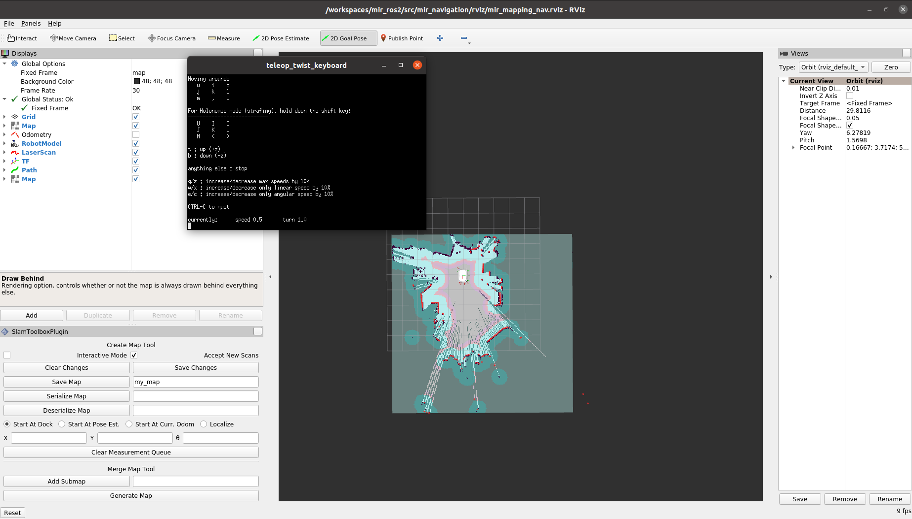
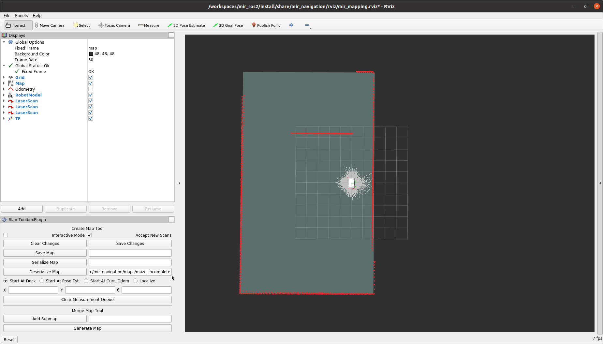
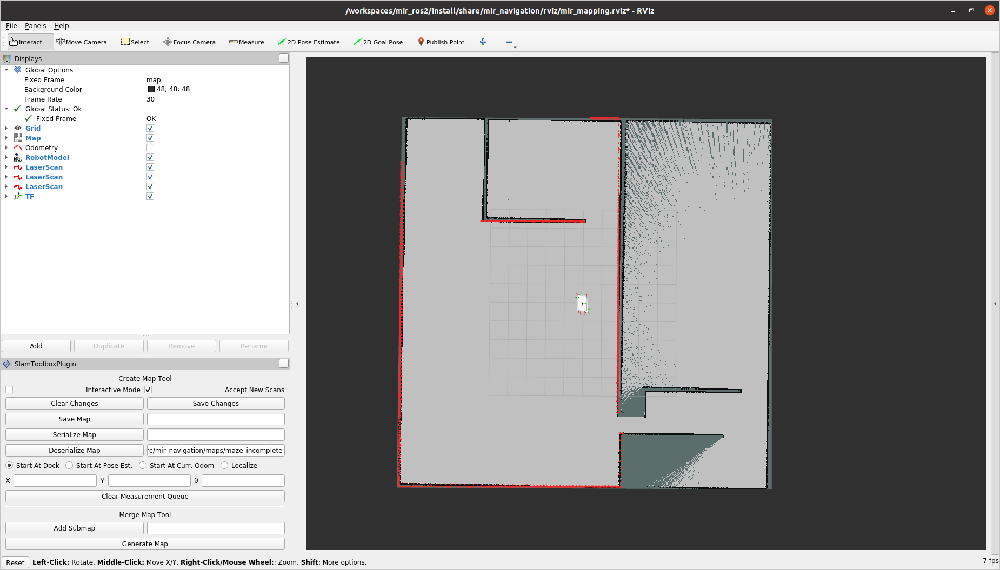
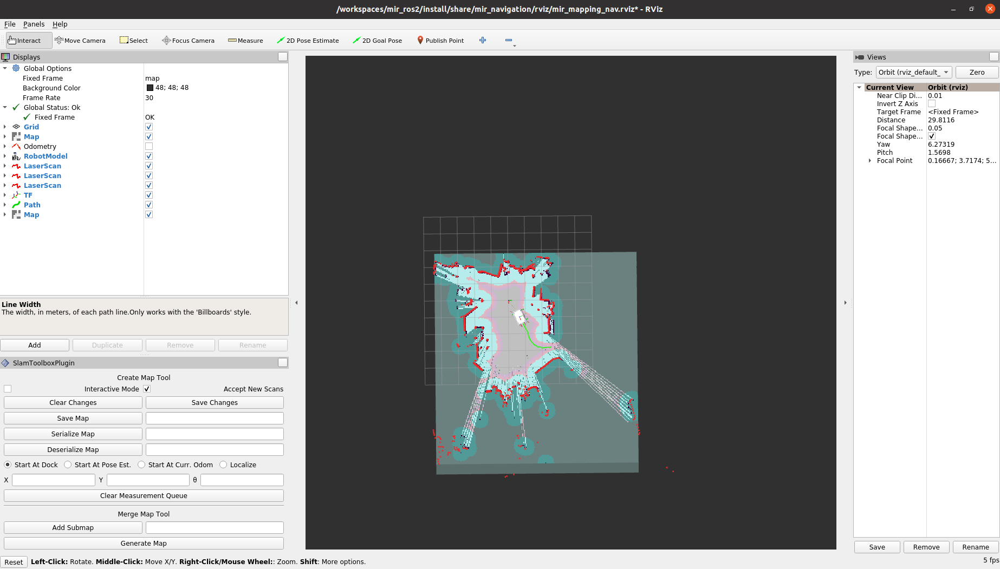
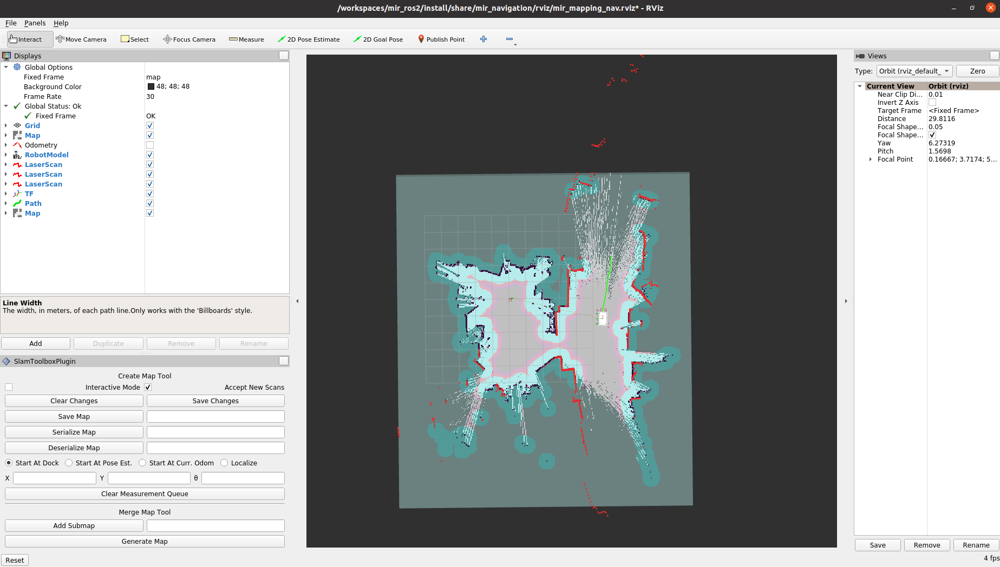
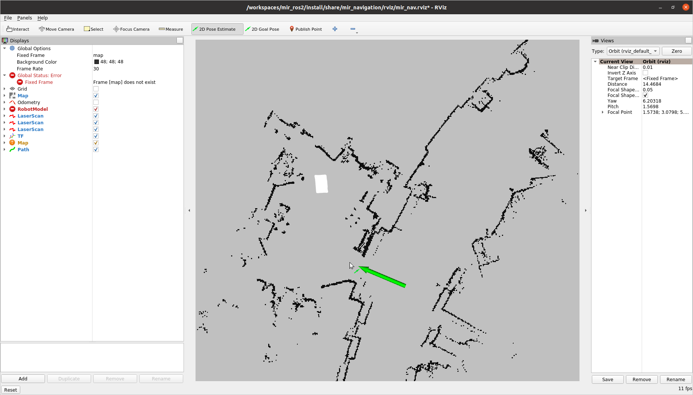
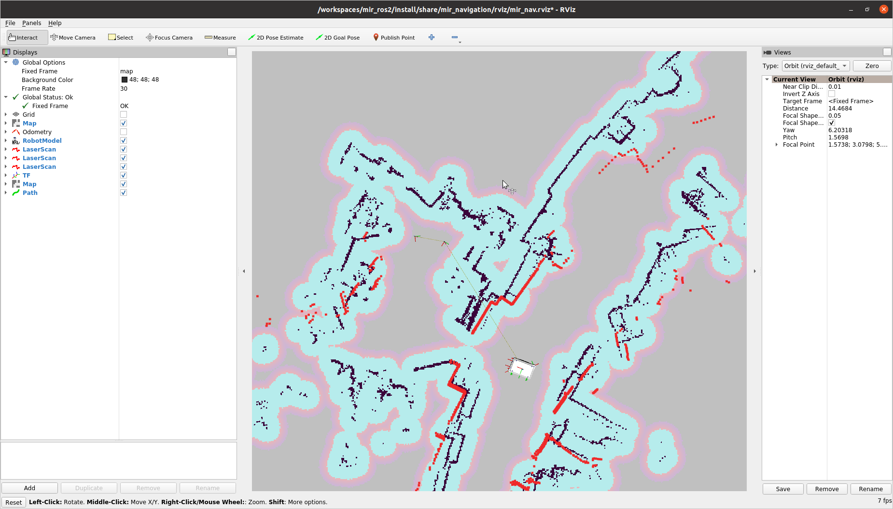
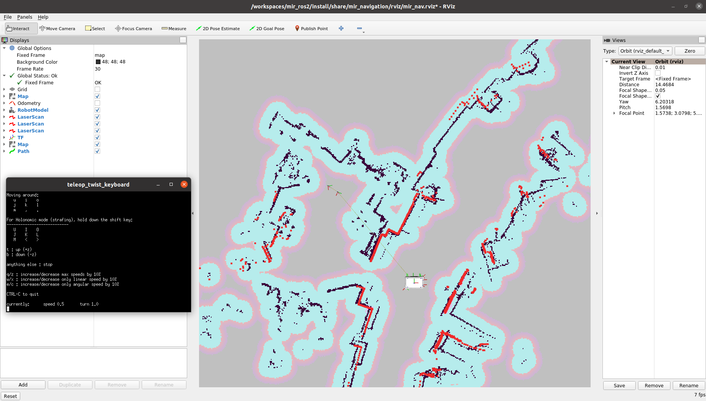

# Disclaimer

**This package is intended to be a migration package of [mir_robot using ros1](https://github.com/dfki-ric/mir_robot) to [ros galactic](https://docs.ros.org/en/galactic/Installation.html). 
It is currently still under heavy development - to be used with caution!**
The following packages have been migrated to galactic:

- [x] mir_description
- [x] mir_driver
- [x] mir_gazebo
- [x] mir_msgs
- [x] mir_navigation

mir_driver
==========

This repo contains a ROS driver and ROS configuration files (URDF description,
Gazebo launch files, move_base config, bringup launch files, message and action
descriptions) for the [MiR robots](http://www.mobile-industrial-robots.com/).
This is a community project created by us ([DFKI](https://www.dfki.de/), the
German Research Center for Artificial Intelligence) to use the MiR Robots with
ROS. We are not affiliated with Mobile Industrial Robots. If you find a bug or
missing feature in this software, please report it on the
[issue tracker](https://github.com/dfki-ric/mir_robot/issues).

Supported MiR robots and software versions
------------------------------------------

<!-- This repo has been confirmed to work with the following robots:

* MiR 100
* MiR 200
* MiR 500

It probably also works with the MiR250 and MiR1000. If you can test it on one
of those, please let us know if it works.

The only supported software version is **MiR software 2.8.3.1**. You can try if
it works with other versions, but this is the one that is known to work. -->


Package overview
----------------

* `mir_actions`: Action definitions for the MiR robot
* `mir_description`: URDF description of the MiR robot
* `mir_dwb_critics`: Plugins for the dwb_local_planner used in Gazebo
* `mir_driver`: A reverse ROS bridge for the MiR robot
* `mir_gazebo`: Simulation specific launch and configuration files for the MiR robot
* `mir_msgs`: Message definitions for the MiR robot
* `mir_navigation`: move_base launch and configuration files


Installation
------------
<!-- 
You can chose between binary and source install below. If you don't want to
modify the source, the binary install is preferred (if `mir_robot` binary
packages are available for your ROS distro). The instructions below use the ROS
distro `noetic` as an example; if you use a different distro (e.g.  `melodic`),
replace all occurrences of the string `noetic` by your distro name in the
instructions. -->

### Preliminaries

#### ROS2 
If you haven't already [installed ROS2](https://docs.ros.org/en/galactic/Installation/Ubuntu-Install-Debians.html) on your PC, you need to add the ROS2 apt
repository. This step is necessary for either binary or source install.

<!-- Package not released yet!

### Binary install

For a binary install, it suffices to run this command:

```bash
sudo apt install ros-noetic-mir-robot
```

See the tables at the end of this README for a list of ROS distros for which
binary packages are available. 

-->

### Source install

For a source install, run the commands below instead of the command from the
"binary install" section.

```bash
# create a ros2 workspace
mkdir -p ~/ros2_ws/src
cd ~/ros2_ws/

# clone mir_robot into the ros2 workspace
git clone -b galactic-devel https://github.com/relffok/mir_robot src/mir_robot

# use vcs to fetch linked repos
vcs import < src/mir_robot/ros2.repos src --recursive

# use rosdep to install all dependencies (including ROS itself)
sudo apt update
sudo apt install -y python3-rosdep
rosdep update
rosdep install --from-paths src --ignore-src -r -y --rosdistro galactic

# build all packages in the workspace
source /opt/ros/galactic/setup.bash
cd ~/ros2_ws
colcon build
```

You must source the workspace in each terminal you want to work in:

```bash
source ~/ros2_ws/install/setup.bash
```
Alternatively you can add the following line to the end of your `~/.bashrc`, and then
close and reopen all terminals:

```bash
echo "source ~/ros2_ws/install/setup.bash" >> ~/.bashrc
```

Gazebo demo (existing map)
--------------------------

### Option 1: Launching the modules separately

```bash
### gazebo
ros2 launch mir_gazebo mir_gazebo_launch.py world:=maze

### localization (existing map)
ros2 launch mir_navigation amcl.py use_sim_time:=true map:=$(ros2 pkg prefix mir_navigation)/share/mir_navigation/maps/maze.yaml

### navigation
ros2 launch mir_navigation navigation.py use_sim_time:=true
```

### Option 2: Use combined launch file 

```bash
### combined launch file
ros2 launch mir_navigation mir_nav_sim_launch.py world:=maze

### (opt) Show possible launch arguments:
ros2 launch mir_gazebo mir_gazebo_launch.py --show-args
```

<!-- ```bash
### localization:
roslaunch mir_navigation amcl.launch initial_pose_x:=10.0 initial_pose_y:=10.0

# navigation:
roslaunch mir_navigation start_planner.launch \
    map_file:=$(rospack find mir_gazebo)/maps/maze.yaml \
    virtual_walls_map_file:=$(rospack find mir_gazebo)/maps/maze_virtual_walls.yaml
rviz -d $(rospack find mir_navigation)/rviz/navigation.rviz
``` -->

<!-- Now, you can use the "2D Nav Goal" tool in RViz to set a navigation goal for move_base.

[](https://vimeo.com/394184430)

(Click image to see video) -->


* **HEADLESS MODE:** To run the simulation without the gazebo graphical interface (performance improvement) add:

        gui:=false


Initialize the position with "2D Pose Estimate". You should see sensor inputs and costmap by now. 
Now, you can use the "2D Goal Pose" tool in RViz to set a navigation goal for move_base

Gazebo demo (mapping)
---------------------

### Option 1: Launching the modules separately

```bash
### gazebo:
ros2 launch mir_gazebo mir_gazebo_launch.py world:=maze

### mapping (slam_toolbox)
ros2 launch mir_navigation mapping.py use_sim_time:=true slam_params_file:=$(ros2 pkg prefix mir_navigation)/share/mir_navigation/config/mir_mapping_async_sim.yaml

### navigation (optional)
ros2 launch mir_navigation navigation.py use_sim_time:=true
```

### Option 2: Use combined launch file 

Instead of launching the 3 modules seperately, you can also use a combined launch file: 

```bash
### combined launch file:
ros2 launch mir_navigation mir_mapping_sim_launch.py
```

* **NAVIGATION**: Navigation is disabled per default. If you like to teleop the robot using nav2 add: 

         navigation_enabled:=true


<!-- 

Gazebo demo (multiple robots)
-----------------------------

If you want to spawn multiple robots into Gazebo, you unfortunately have to
hard-code the name of the second robot into the `mir_empty_world.launch` file,
like this:

```diff
diff --git i/mir_gazebo/launch/mir_empty_world.launch w/mir_gazebo/launch/mir_empty_world.launch
index 27b9159..7773fae 100644
--- i/mir_gazebo/launch/mir_empty_world.launch
+++ w/mir_gazebo/launch/mir_empty_world.launch
@@ -17,6 +17,10 @@
       <remap from="$(arg namespace)/mobile_base_controller/cmd_vel" to="$(arg namespace)/cmd_vel" />
       <remap from="$(arg namespace)/mobile_base_controller/odom"    to="$(arg namespace)/odom" />

+      <remap from="mir2/joint_states"                   to="mir2/mir/joint_states" />
+      <remap from="mir2/mobile_base_controller/cmd_vel" to="mir2/cmd_vel" />
+      <remap from="mir2/mobile_base_controller/odom"    to="mir2/odom" />
+
       <include file="$(find gazebo_ros)/launch/empty_world.launch">
         <arg name="world_name" value="$(arg world_name)"/>
         <arg name="paused" value="true" />
```

Then you can run the simulation like this:

```bash
# start Gazebo + first MiR
roslaunch mir_gazebo mir_maze_world.launch tf_prefix:=mir

# first MiR: start localization, navigation + rviz
roslaunch mir_navigation amcl.launch initial_pose_x:=10.0 initial_pose_y:=10.0 tf_prefix:=mir#
roslaunch mir_navigation start_planner.launch \
        map_file:=$(rospack find mir_gazebo)/maps/maze.yaml \
        virtual_walls_map_file:=$(rospack find mir_gazebo)/maps/maze_virtual_walls.yaml prefix:=mir/
ROS_NAMESPACE=mir rviz -d $(rospack find mir_navigation)/rviz/navigation.rviz

# spawn second MiR into Gazebo
roslaunch mir_gazebo mir_gazebo_common.launch robot_x:=-2 robot_y:=-2 tf_prefix:=mir2 model_name:=mir2 __ns:=mir2

# second MiR: start localization, navigation + rviz
roslaunch mir_navigation amcl.launch initial_pose_x:=8.0 initial_pose_y:=8.0 tf_prefix:=mir2
roslaunch mir_navigation start_planner.launch \
        map_file:=$(rospack find mir_gazebo)/maps/maze.yaml \
        virtual_walls_map_file:=$(rospack find mir_gazebo)/maps/maze_virtual_walls.yaml prefix:=mir2/
ROS_NAMESPACE=mir2 rviz -d $(rospack find mir_navigation)/rviz/navigation.rviz
``` -->


Running the driver on the real robot
------------------------------------

### Start up the robot

* switch on MiR base


### Connect to the MiR web interface

* connect to MiR_R??? wifi (password "mirex4you"), for example from your Android phone/tablet
* disable other network connections (mobile data / LAN / etc.)
* open mir.com (192.168.12.20) in Chrome (!)
* log in (admin/mir4you)

### Synchronize system time

The internal robot PC's is not synchronized (for example via NTP), so it tends
to get out of sync quickly (about 1 second per day!). This causes TF transforms
timing out etc. and can be seen using `tf_monitor` (the "Max Delay" is about
3.3 seconds in the following example, but should be less than 0.1 seconds):

#### **Determine delay using ROS1** (optional)

Since MiR is running a roscore (ROS1), the following tf_monitor can be excecuted after sourcing ROS1 (i.e. noetic) first:

```bash
source /opt/ros/noetic/setup.bash
export ROS_MASTER_URI=http://192.168.12.20:11311
```


```bash
$ rosrun tf tf_monitor
Frames:
Frame: /back_laser_link published by unknown_publisher Average Delay: 3.22686 Max Delay: 3.34766
Frame: /base_footprint published by unknown_publisher Average Delay: 3.34273 Max Delay: 3.38062
Frame: /base_link published by unknown_publisher Average Delay: 3.22751 Max Delay: 3.34844
[...]

All Broadcasters:
Node: unknown_publisher 418.344 Hz, Average Delay: 0.827575 Max Delay: 3.35237
Node: unknown_publisher(static) 465.362 Hz, Average Delay: 0 Max Delay: 0
```

#### **Determine delay using ROS2**

If you don't have a ROS1 distro installed, you'll need to run the `mir_driver` first and execute the following once a connection is established: 

```bash
ros2 run tf2_ros tf2_monitor
```


#### **Fix time synchronization manually:**

* In the Mir dashboard (mir.com in the Mir-Wifi), go to "Service" -> "Configuration" -> "System settings" -> "Time settings" -> "Set device time on robot"
Use **load from device** to sync with the system time!

#### **Fix time synchronization using ROS2:**

From the package `mir_restapi` a node called `mir_restapi_server` can be run, which can execute a time sync REST API call from the driver's host machine to the Mir's host. 
* Launch the node with the API key and mir hostname's IP address

        ros2 run mir_restapi mir_restapi_server --ros-args -p mir_hostname:='MIR_IP_ADDR' -p mir_restapi_auth:='YOUR_API_KEY'
* Call the time sync service from terminal by invoking
        
        ros2 service call /mir_100_sync_time std_srvs/Trigger

#### **After time sync**

Keep in mind, that the time sync causes the mir_bridge to freeze. Therefore online time syncs are not recommended.


### Start `move_base` on the robot

* go to "Service" -> "Configuration" -> "Launch menu", start "Planner"; this starts `move_base` and `amcl` on the robot


### Teleoperate the robot (optional)

* go to "Manual", press yellow button (LEDs change from yellow to blue); now the robot can be teleoperated


### Relocalize robot (optional)

If the robot's localization is lost:

* go to "Service" -> "Command view" -> "Set start position" and click + drag to current position of robot in the map
* click "Adjust"

### Start the ROS driver

```bash
ros2 launch mir_driver mir_launch.py
```

* The driver automatically launches **rviz** to visualize the topics and sensor messages. To disable use `rviz_enabled:=false` as a launch argument
* The driver automatically launches a seperate **teleop** window to manually move the robot using your keyboard. To disable use `teleop_enabled:=false` as a launch argument

### Mapping on MiR

### Option 1: Launching the modules separately

```bash
### driver:
ros2 launch mir_driver mir_launch.py

### mapping (slam_toolbox)
ros2 launch mir_navigation mapping.py use_sim_time:=false slam_params_file:=$(ros2 pkg prefix mir_navigation)/share/mir_navigation/config/mir_mapping_async.yaml

### navigation (optional)
ros2 launch mir_navigation navigation.py use_sim_time:=false
```

### Option 2: Use combined launch file 
```bash
### combined launch file:
ros2 launch mir_navigation mir_mapping_launch.py
```

### Navigation on MiR

### Option 1: Launching the modules separately

```bash
### driver:
ros2 launch mir_driver mir_launch.py

### localization (amcl)
ros2 launch mir_navigation amcl.py use_sim_time:=false map:={path to existing map}

### navigation
ros2 launch mir_navigation navigation.py use_sim_time:=false
```

### Option 2: Use combined launch file 
```bash
### combined launch file:
ros2 launch mir_navigation mir_nav_launch.py map:={path to /name of existing map}
```

On Mapping
------------------------------------
As mentioned before, you can launch the differnet modules seperately or use the combined launch commands below: 

In **Simulation** run:

    ros2 launch mir_navigation mir_mapping_sim_launch.py

On **MiR** run:

    ros2 launch mir_navigation mir_mapping_launch.py

Both commands launch the simulation / driver and SLAM node.

## How to map
To save the created map, use the rviz plugin **"Save Map"** and **"Serialize Map"**. From time to time segmentation faults or timeouts occur, so make sure your map is saved before shutting down the connection.



### Refine existing map
The given launch commands will create a fresh new map of the environment. If you like to adapt an existing map (must be serialized!) you can **deserialize it** using the rviz slam_toolbox plugin. 

Select map to deserialize | and continue mapping
:--------------:|:--------------:
 | 


###  Helpful launch arguments 

* **NAVIGATION**: Navigation is disabled per default. If you like to teleoperate the robot using nav2 add: 

         navigation_enabled:=true

Mapping.. | ..using nav2
:--------------:|:--------------:
 | 


On Localization and Navigation
------------------------------------
As mentioned before, you can launch the differnet modules seperately or use the combined launch commands below: 

In **Simulation** run:

    ros2 launch mir_navigation mir_nav_sim_launch.py

On **MiR** run:

    ros2 launch mir_navigation mir_nav_launch.py map:={path to existing map}

Both commands launch the simulation / driver and localization (amcl) using an existing map.

###  Helpful launch arguments 
* **MAP**: In Simulation the map defaults to the maze map. On the real robot a map should be passed via  the ``map`` argument

         map:= {path_to_map_yaml}
         world:={world_file} # simulation only: add respective world

### Workflow

Once the simulation / driver is running and rviz is started, you need to **set the initial pose** on the map. This doesnt have to be accurate, just a reference and amcl will do the refinement. To refine, **move the robot** around a little using the teleop window and the scan will eventually match the map.

Initialize Pose | Drifted pose | Refined pose
:--------------:|:--------------:|:--------------:
 ||


Using a namespace
------------------------------------

When using a namespace for your robot, add the ``--ros-args -p namespace:=my_namespace`` to the launch files.
The driver, description and gazebo packages work out of the box. 
However, to use the navigation stack the corresponding config.yaml files need to be adapted to match the renamed topic.

The navigation ``cmd_vel`` topic is automatically remapped by adding the namespace in the ``navigation.py`` launch file.

<!--
  
Troubleshooting
---------------

### Got a result when we were already in the DONE state

Sometimes the move_base action will print the warning "Got a result when we
were already in the DONE state". This is caused by a race condition between the
`/move_base/result` and `/move_base/status` topics. When a status message with
status `SUCCEEDED` arrives before the corresponding result message, this
warning will be printed. It can be safely ignored. -->


<!-- Travis - Continuous Integration
-------------------------------

| Melodic                                                                                                                  | Noetic                                                                                                                  |
|--------------------------------------------------------------------------------------------------------------------------|-------------------------------------------------------------------------------------------------------------------------|
| [](https://travis-ci.org/dfki-ric/mir_robot) | [](https://travis-ci.org/dfki-ric/mir_robot) |


ROS Buildfarm
-------------

|                                                        | Melodic source deb                                                                                                                                                                      | Melodic binary deb                                                                                                                                                                                      | Noetic source deb                                                                                                                                                                     | Noetic binary deb                                                                                                                                                                                     |
|--------------------------------------------------------|-----------------------------------------------------------------------------------------------------------------------------------------------------------------------------------------|---------------------------------------------------------------------------------------------------------------------------------------------------------------------------------------------------------|---------------------------------------------------------------------------------------------------------------------------------------------------------------------------------------|-------------------------------------------------------------------------------------------------------------------------------------------------------------------------------------------------------|
| [mir_actions](http://wiki.ros.org/mir_actions)         | [](http://build.ros.org/job/Msrc_uB__mir_actions__ubuntu_bionic__source/)         | [](http://build.ros.org/job/Mbin_uB64__mir_actions__ubuntu_bionic_amd64__binary/)         | [](http://build.ros.org/job/Nsrc_uF__mir_actions__ubuntu_focal__source/)         | [](http://build.ros.org/job/Nbin_uF64__mir_actions__ubuntu_focal_amd64__binary/)         |
| [mir_description](http://wiki.ros.org/mir_description) | [](http://build.ros.org/job/Msrc_uB__mir_description__ubuntu_bionic__source/) | [](http://build.ros.org/job/Mbin_uB64__mir_description__ubuntu_bionic_amd64__binary/) | [](http://build.ros.org/job/Nsrc_uF__mir_description__ubuntu_focal__source/) | [](http://build.ros.org/job/Nbin_uF64__mir_description__ubuntu_focal_amd64__binary/) |
| [mir_driver](http://wiki.ros.org/mir_driver)           | [](http://build.ros.org/job/Msrc_uB__mir_driver__ubuntu_bionic__source/)           | [](http://build.ros.org/job/Mbin_uB64__mir_driver__ubuntu_bionic_amd64__binary/)           | [](http://build.ros.org/job/Nsrc_uF__mir_driver__ubuntu_focal__source/)           | [](http://build.ros.org/job/Nbin_uF64__mir_driver__ubuntu_focal_amd64__binary/)           |
| [mir_dwb_critics](http://wiki.ros.org/mir_dwb_critics) | [](http://build.ros.org/job/Msrc_uB__mir_dwb_critics__ubuntu_bionic__source/) | [](http://build.ros.org/job/Mbin_uB64__mir_dwb_critics__ubuntu_bionic_amd64__binary/) | [](http://build.ros.org/job/Nsrc_uF__mir_dwb_critics__ubuntu_focal__source/) | [](http://build.ros.org/job/Nbin_uF64__mir_dwb_critics__ubuntu_focal_amd64__binary/) |
| [mir_gazebo](http://wiki.ros.org/mir_gazebo)           | [](http://build.ros.org/job/Msrc_uB__mir_gazebo__ubuntu_bionic__source/)           | [](http://build.ros.org/job/Mbin_uB64__mir_gazebo__ubuntu_bionic_amd64__binary/)           | [](http://build.ros.org/job/Nsrc_uF__mir_gazebo__ubuntu_focal__source/)           | [](http://build.ros.org/job/Nbin_uF64__mir_gazebo__ubuntu_focal_amd64__binary/)           |
| [mir_msgs](http://wiki.ros.org/mir_msgs)               | [](http://build.ros.org/job/Msrc_uB__mir_msgs__ubuntu_bionic__source/)               | [](http://build.ros.org/job/Mbin_uB64__mir_msgs__ubuntu_bionic_amd64__binary/)               | [](http://build.ros.org/job/Nsrc_uF__mir_msgs__ubuntu_focal__source/)               | [](http://build.ros.org/job/Nbin_uF64__mir_msgs__ubuntu_focal_amd64__binary/)               |
| [mir_navigation](http://wiki.ros.org/mir_navigation)   | [](http://build.ros.org/job/Msrc_uB__mir_navigation__ubuntu_bionic__source/)   | [](http://build.ros.org/job/Mbin_uB64__mir_navigation__ubuntu_bionic_amd64__binary/)   | [](http://build.ros.org/job/Nsrc_uF__mir_navigation__ubuntu_focal__source/)   | [](http://build.ros.org/job/Nbin_uF64__mir_navigation__ubuntu_focal_amd64__binary/)   |
| [mir_robot](http://wiki.ros.org/mir_robot)             | [](http://build.ros.org/job/Msrc_uB__mir_robot__ubuntu_bionic__source/)             | [](http://build.ros.org/job/Mbin_uB64__mir_robot__ubuntu_bionic_amd64__binary/)             | [](http://build.ros.org/job/Nsrc_uF__mir_robot__ubuntu_focal__source/)             | [](http://build.ros.org/job/Nbin_uF64__mir_robot__ubuntu_focal_amd64__binary/)             |
| [sdc21x0](http://wiki.ros.org/sdc21x0)                 | [](http://build.ros.org/job/Msrc_uB__sdc21x0__ubuntu_bionic__source/)                 | [](http://build.ros.org/job/Mbin_uB64__sdc21x0__ubuntu_bionic_amd64__binary/)                 | [](http://build.ros.org/job/Nsrc_uF__sdc21x0__ubuntu_focal__source/)                 | [](http://build.ros.org/job/Nbin_uF64__sdc21x0__ubuntu_focal_amd64__binary/)                 |

|                                            | Melodic devel                                                                                                                                                    | Melodic doc                                                                                                                                                      | Noetic devel                                                                                                                                                   | Noetic doc                                                                                                                                                     |
|--------------------------------------------|------------------------------------------------------------------------------------------------------------------------------------------------------------------|------------------------------------------------------------------------------------------------------------------------------------------------------------------|----------------------------------------------------------------------------------------------------------------------------------------------------------------|----------------------------------------------------------------------------------------------------------------------------------------------------------------|
| [mir_robot](http://wiki.ros.org/mir_robot) | [](http://build.ros.org/job/Mdev__mir_robot__ubuntu_bionic_amd64) | [](http://build.ros.org/job/Mdoc__mir_robot__ubuntu_bionic_amd64) | [](http://build.ros.org/job/Ndev__mir_robot__ubuntu_focal_amd64) | [](http://build.ros.org/job/Ndoc__mir_robot__ubuntu_focal_amd64) | -->
